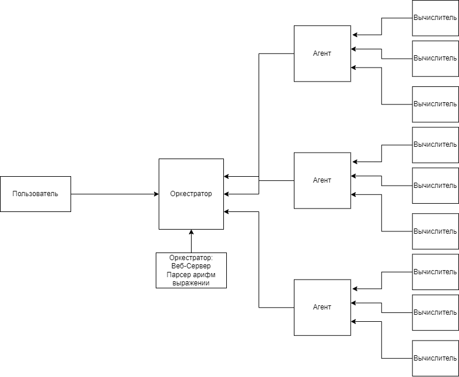

# DAEC
Код запускает с помощью docker-compose.
А точнее команды:
```
docker-compose up
```
Остановить приложение можно с помощью:
```
docker-compose down
```
Либо полностью убрать все связанное с моим проектов с помощью:
```
docker-compose down -v
```
Это удалит еще и хранилища.

# Эксплуатация  

Так как у проекта отсутствует веб-интерфейс, придется пользоваться cURL или PostMan.
Ниже будут приведены примеры запросов (Тело запроса виде json):
## Добавление выражения
```
curl -X POST -d '{"expression":"2*2 + 4"}' http://localhost:8080/api/expression -v
```
## Узнать статус выражения
Обычный запрос на создание выражения, он возвращает айди выражения
```
curl localhost:8080/api/expressions/:id -v
```
С помощью этого запроса можно узнать статус нашего выражения.
## Список всех выражении
```
curl localhost:8080/api/expressions/ -v
```
Это список вообще всех выражений правильных, неправильных , подсчитанных или только ожидающих это.

## Принять выражение для вычисления
```
curl -H "X-Agent-Name: agent 007" localhost:8080/api/task?calculator=1
```
С помощью этого запроса можно получить задание на выполнение, правда если у вас выражение сложнее , чем 2+2 и нужно 10 и больше секунд, оркестратор заберет у вас выражение и сделает его снова ожидающим.

## Monitor
Также можно посмотреть какой агент и его вычислителей решают какую-нибудь задачу.
```
curl localhost:8080/api/monitor
```

Остальные запросы уже больше касаются агента:
- Пинг
- Отправка Результата
- Получение списка выражении со их скоростью (хотя я их назвал стоимостью)


# Схема 


